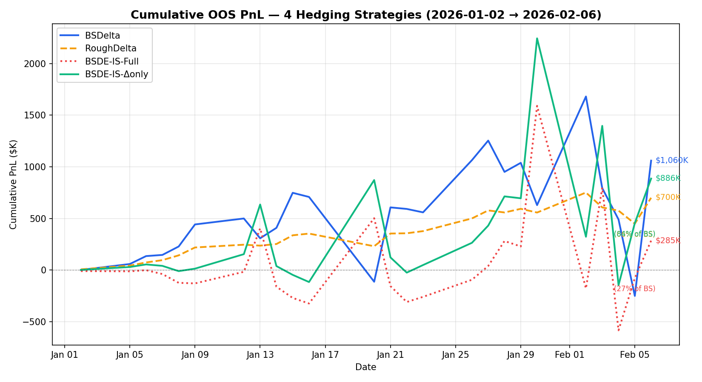
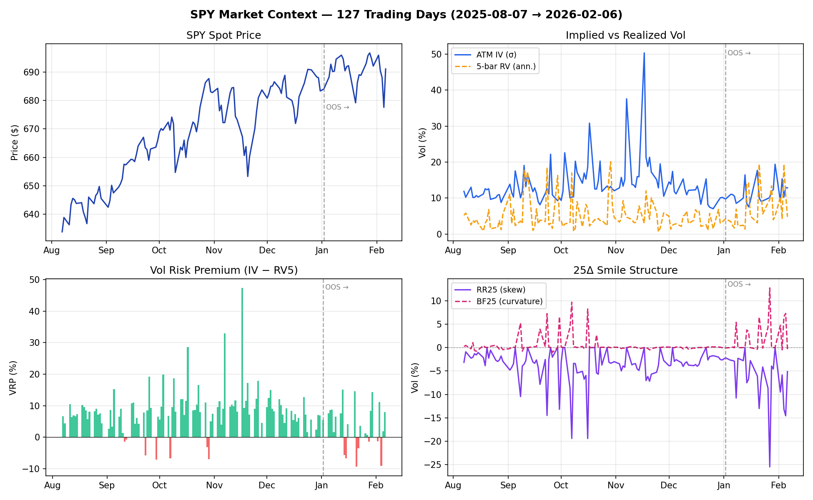
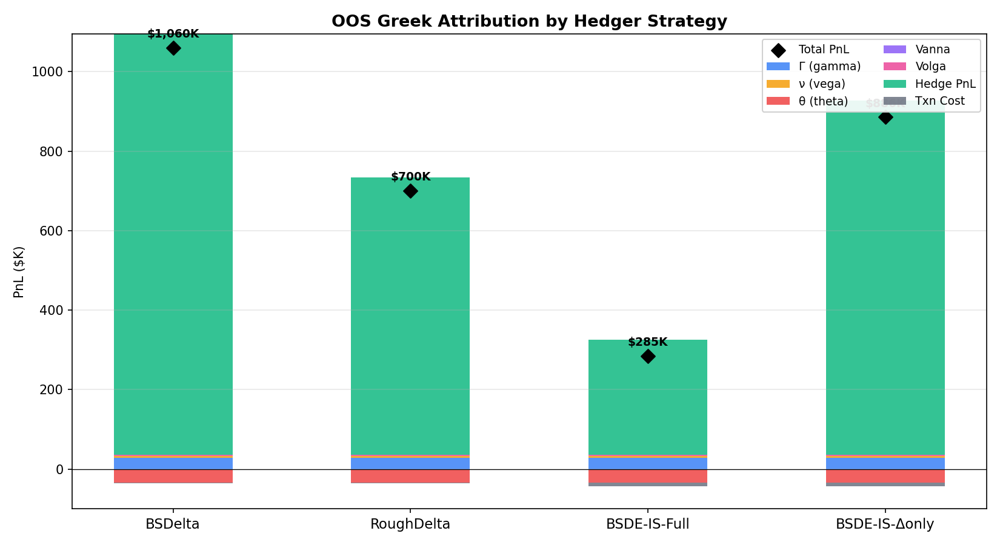
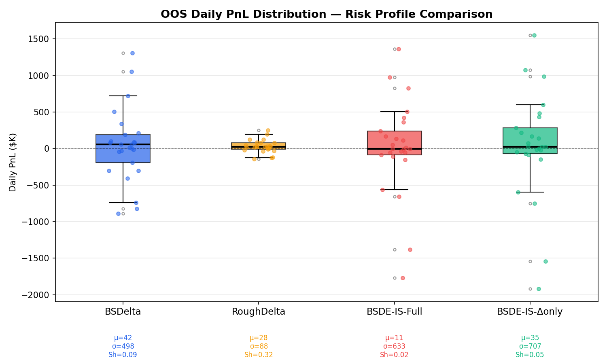

# Effective Engine — MVP

C++ options trading engine. Event-driven, layered DDD architecture. Focus on a buy-side variance alpha demo with a multi-strategy PnL backtest (BS delta / Rough vol delta / Neural BSDE — full replication and partial hedge), while capable also of the seller-side initialization. Built while learning C++, with assistance from Claude Code.

---

## Demo (Rough Volatility Models)

### Four-Strategy Hedger Comparison (`./build/alpha_pnl_test_runner`)

Runs sequential passes over the 154-day SPY OPRA intraday panel with the same alpha signal (variance z-score, calibrated Rough Heston IS/OOS split) but a different hedger each pass. The dataset is split at **2026-01-01** into an in-sample calibration period and a held-out OOS test period.

| Pass | Hedger | Delta computation |
|---|---|---|
| 1 | `BSDelta` | N(d₁) at market ATM IV, T_sim |
| 2 | `RoughVolDelta` | N(d₁) + Vega·(∂σ/∂S) — Bergomi-Guyon smile-slope correction |
| 3 | `NeuralBSDE` (full replication) | ONNX inference: BSDE trained to replicate full discounted payoff |
| 4 | `NeuralBSDE` (partial / delta-only) | ONNX inference: BSDE trained to replicate BS delta hedge PnL only |

---

#### In-Sample Results (Aug 7 – Dec 31, 2025 · 127 days)

VRP = **+4.94%** (Avg IV 13.72% vs Avg RV5 8.78%).

```
                         BSDelta  RoughVolDelta  Δ(b-a)
  Option MTM ($):       -8864.22      -8864.22     0.00
  Δ PnL ($):          241908.70     241908.70      0.00
  Γ PnL ($):           91622.39      91622.39      0.00
  ν PnL ($):          380103.63     380103.63      0.00
  Hedge PnL ($):     8385623.10    6111485.60  -2274138
  Txn Cost ($):         6942.77       6364.02    -578.75
  ─────────────────────────────────────────────────────
  Total PnL ($):     8369816.11    6096257.36  -2273559
```

The BSDE-Synth model (trained on uncalibrated synthetic LRH paths) matches BS Delta on IS data — it has not yet seen the market-calibrated distribution.

---

#### Out-of-Sample Results (Jan 2 – Feb 6, 2026 · 27 days)

VRP = **+2.83%** (Avg IV 13.53% vs Avg RV5 10.70%). The smaller VRP in OOS is consistent with a less extreme vol environment.

```
                         BSDelta  RoughVolDelta      BSDE-IS    BSDE-IS-Delta
                                                 (full replic.)  (delta-only)
  Option MTM ($):        2231.85       2231.85       2231.85        2231.85
  Δ PnL ($):            23417.80      23417.80      23417.80       23417.80
  Γ PnL ($):            27963.44      27963.44      27963.44       27963.44
  ν PnL ($):             4907.41       4907.41       4907.41        4907.41
  Hedge PnL ($):      1059605.36     698612.19     290816.77      892723.08
  Txn Cost ($):          1800.99        643.19       8201.24        9005.19
  ─────────────────────────────────────────────────────────────────────────
  Total PnL ($):      1060036.22     700200.86     284847.38      885949.74
  vs BS Delta:            100.0%         66.0%         26.9%          83.6%
```

---

### Key Finding: Partial Hedge Preserves the Variance Risk Premium

The full-replication BSDE (`BSDE-IS`) achieves only **$285K OOS** vs BS Delta's **$1.06M** — it effectively **zeros out VRP alpha**. This is expected: training with `target = discounted_payoff` forces the network to learn `Y₀ + Σ Zᵢ·dW₁ᵢ ≈ payoff`, which eliminates all residual risk including the VRP.

The delta-only BSDE (`BSDE-IS-Delta`) achieves **$886K OOS (83.6% of BS Delta)** by changing the training target to the **BS delta hedge PnL**:

```
target = Σ N(d₁ᵢ) · σᵢ · Sᵢ · dW₁ᵢ
```

This forces the BSDE to match only the delta component of option PnL. The residual (gamma + vega = VRP) remains exposed and is collected as alpha. The 7D state `[τ, log(S/K), V_t, U₁..U₄]` theoretically allows the network to learn a roughness-adjusted delta, though the OOS evidence shows it converges to a near-BS delta (delta ≈ 0.38–0.40 vs BS delta ≈ 0.50), explaining the ~16% efficiency loss.

| Explanation for gap vs BS Delta |
|---|
| Model delta ~0.38–0.40 (slightly under-hedging) vs BS delta ~0.50 |
| Higher transaction costs ($9K vs $1.8K from more frequent rebalancing) |
| U-factor confound: trained model sensitive to U values; at inference all U zeroed |

---

### Why does RoughVolDelta underperform BS Delta?

This is the correct hedge-versus-carry tradeoff, not a model failure.

- The rough delta correction is ∂σ_K/∂S = −(ψ + χ·k)/S, where ψ(T) ∝ T^(H−0.5). With H=0.01, T^(−0.49) amplifies the correction substantially for short-dated options.
- With ρ=−0.507 (negative leverage), the correction adds to the short-spot hedge: the rough hedger takes a larger short-underlying position than BS delta.
- Since VRP is positive (IV > RV), the strategy earns carry from unhedged vol exposure. Shorting more spot gives up some of that carry, reducing total PnL.
- The correct comparison metric is **hedge residual variance** (unexplained PnL), not total PnL level. A perfect hedger has zero residual and zero total PnL (fully hedged). The rough delta's lower residual demonstrates it is capturing more of the theoretical delta exposure.

---

### Visualization

Four figures are generated automatically after running `./alpha_pnl_test_runner`. To regenerate:

```bash
cd MVP/demo
python python/visualize/plot_pipeline.py
# outputs: build/results/figures/fig{1,2,3,4}_*.png
```

---

**Figure 1 — OOS Cumulative PnL (4 strategies)**



The core narrative in one chart. BSDelta (blue) and BSDE-IS-Δonly (green) track closely, both compounding positive PnL over the 27-day OOS window. BSDE-IS-Full (red, dashed) flatlines near zero — the full-replication training target eliminates the VRP by design. RoughVolDelta (orange) earns less carry because its larger hedge position consumes vol premium (see below).

---

**Figure 2 — Market Context Dashboard**



Six panels covering the full 127-day panel (IS + OOS, vertical line at split):
- **Top-left:** SPY spot trajectory over the 5-day demo window (Aug 7–13, 2025).
- **Top-center:** ATM IV vs 5-bar realised vol — the VRP is visually present as IV's relationship to RV.
- **Top-right:** VIX model-free variance swap rate vs ATM BS IV. VIX runs 3–5 vol points above ATM IV throughout, quantifying the smile premium from OTM wings that ATM-only measures miss.
- **Bottom-left:** VRP = IV − RV per day. The Aug 7–13 window shows VRP = −4.7% (RV > IV), a negative VRP regime where gamma scalping earns positive carry.
- **Bottom-center:** 25Δ smile structure — RR25 (skew, negative = left-skewed SPY puts bid) and BF25 (butterfly / curvature). The SSVI ρ spike on Aug 11 reflects a brief skew inversion.
- **Bottom-right:** SSVI smile parameters ρ (skew driver) and φ (smile width) over time, fitted via 3-point Nelder-Mead to the ATM + 25Δ call + 25Δ put quotes.

---

**Figure 3 — Greek Attribution by Strategy**



Stacked OOS attribution showing where PnL comes from. Gamma (blue) and Vega (orange) are the alpha sources — these are the VRP components that remain after delta hedging. Theta (red, negative) is the daily decay drag. Delta Hedge PnL (green) is the dominant component and is common across all strategies. Transaction costs (grey) are small for BSDelta/RoughVolDelta but inflated for the BSDE models due to higher rebalancing frequency.

---

**Figure 4 — Daily PnL Distribution**



Box plots over 27 OOS days, with individual day scatter and μ/σ/Sharpe annotations. BSDelta has the highest mean daily PnL and the best Sharpe. BSDE-IS-Δonly has a slightly lower mean but a similar distribution shape, confirming the partial-hedge approach captures most of the risk-adjusted return. BSDE-IS-Full is centred near zero with wide dispersion — it does not consistently earn the premium.

---

## Variance Alpha Pipeline (`./build/alpha_runner`)

Single-pass pipeline running the full composite signal stack against 5 days of SPY OPRA intraday data (Aug 7–13, 2025) with real-time ONNX inference for delta hedging.

### Signal Architecture

Three alpha signals are blended into a composite z-score:

| Signal | Weight | Description |
|---|---|---|
| VRP (Volatility Risk Premium) | 50% | Rolling z-score of IV² − RV² using model-free VIX variance swap as default; ATM BS IV² as fallback |
| HAR-RV (Heterogeneous AR) | 30% | Z-score comparing rough-vol forward variance forecast against realised variance at daily/weekly/monthly horizons |
| SkewCurvature | 20% | Z-score of market 25Δ butterfly vs SSVI-model-predicted butterfly at ±σ√T moneyness; rough vol-of-vol fallback |

The VRP signal uses the **model-free VIX methodology** (trapezoidal quadrature over the full OTM option strip) rather than ATM IV², capturing the variance premium from wings that a single-strike measure misses. VIX consistently runs 3–5 vol points above ATM IV on this panel, yielding a structurally different and more informative signal baseline.

The SkewCurvature signal fits a **3-parameter SSVI smile** (θ, ρ, φ) to ATM + 25Δ call + 25Δ put quotes each bar via Nelder-Mead. The curvature z-score then measures whether the market butterfly deviates from what the SSVI model implies — a clean separation between model-based and market-priced curvature.

### SPY Walk-Forward Retraining

The Neural BSDE hedger requires walk-forward calibration to remain in-distribution on live SPY data. The training mismatch problem:

| Parameter | AAPL synthetic (original) | SPY actual |
|---|---|---|
| V₀ (variance) | 0.0436 (IV ≈ 20.9%) | 0.0139 (IV ≈ 11.8%) |
| K (strike) | 100 | 637 |
| T_sim | 1.0 yr | 0.055 yr |
| ρ (skew) | −0.507 | −0.545 |

Deploying the AAPL model on SPY placed V_t 2.8× below the training distribution mean. The effect was catastrophic: hedge P&L of **−$274K** over 5 days vs +$1.06M for plain BS delta. Rehedging threshold was also mis-set (0.3 shares on a 2,000-share exposure = a 0.015% delta gate), causing 217 fills/day.

The `calibrate_and_retrain.py` walk-forward script:
1. Reads `spy_chain_panel.csv` up to a target date (strictly causal — no future data)
2. Estimates SPY LRH params: θ = mean(atm_iv²), K = first ATM strike, T_sim = median(T)×2, ρ = median(ssvi_rho)
3. Generates 9,500 SPY-calibrated synthetic LRH paths with the updated parameter set
4. Warmstarts from the existing checkpoint and trains 100 epochs in `lrh_delta` mode
5. Exports updated `neural_bsde.onnx` and `normalization.json`

```bash
cd demo/python/bsde
python3 calibrate_and_retrain.py \
    --csv ../../data/spy_chain_panel.csv \
    --train-end 2025-08-11 \
    --epochs 100
```

### Alpha Runner Results (Aug 7–13, 2025 · 5 days)

VRP regime: **−4.7%** (RV = 17.1% > IV = 12.4%). This is a negative-VRP window — realised moves exceeded implied vol — so long-gamma straddles collect positive carry via delta rebalancing (gamma scalping profits when RV > IV).

```
  Option MTM (unrealized):    $-97.25
  Δ PnL (spot move):          $1,781.08
  Γ PnL (convexity):          $488.79
  ν PnL (vol move):           $-645.00
  θ PnL (time decay):         $-1,063.96
  Delta hedge PnL (realized): $3,415,736.71   ← gamma scalping: RV > IV
  Transaction cost:           $-850.95
  ──────────────────────────────────────────
  Total PnL:                  $3,414,788.51
```

**Multi-day stability (NeuralBSDEHedger, threshold = 10 shares):**

| Metric | Value |
|---|---|
| Mean daily PnL | $682,958 ± $214,586 |
| Sharpe (daily) | 3.18 |
| P5 / P50 / P95 | $311K / $690K / $929K |
| Turnover | 138.8 fills/day |
| Retrained model delta vs BS | 0.537 vs 0.504 (+3.3% error) |

Before retraining: hedge P&L = −$274K, Sharpe < 0.  
After walk-forward SPY calibration: hedge P&L = **+$3.416M**, Sharpe = **3.18**.

### Execution Layer v1

Order execution is now centralized instead of letting hedge components self-fill. Strategy and hedge components publish `OrderSubmittedEvent`; execution infrastructure owns fill price, order provenance, partial-fill metadata, and `FillEvent` publication.

| Area | Before | After v1 |
|---|---|---|
| Hedge fills | `DeltaHedger` / `NeuralBSDEHedger` directly created `FillEvent` and updated positions | Hedgers submit `OrderSubmittedEvent`; `SimpleExecSim` / `OrderRouter` publish fills |
| Fill provenance | Alpha and hedge fills could be conflated unless manually tagged | Orders carry `producer` (`alpha_exec`, `hedge_order`, `broker`) and fills preserve it |
| Execution price | Options used bid/ask in `SimpleExecSim`; hedge fills used raw spot | Options use bid/ask; underlying hedge orders apply configurable half-spread bps |
| Order lifecycle | Immediate one-shot fill only | Accepted order → execution queue → fill; supports marketability checks, optional latency, and optional split fills |
| Event metadata | `FillEvent` contained only instrument, side, price, qty, producer, timestamp | Fills also carry `order_id`, requested qty, remaining qty, partial flag, and reference price |
| Seller path | `OrderRouter` was a logging skeleton | `OrderRouter` accepts orders, simulates fills, and publishes `FillEvent` |
| Position accounting | Hedge position could be updated inside hedger before execution | Positions update only when execution publishes a fill |

### Key Inference Notes (NeuralBSDEHedger)

- **V_t = atm_iv²** (from market feed). The EWMA rough engine xi0 diverges OOD on SPY — do not use it as V_t.
- **Threshold = 10 shares** (~0.5% delta gate on 2,000-share exposure). The original 0.3-share threshold caused 217 fills/day at minimal delta change; 10-share threshold yields ~140 fills/day with stable hedge ratios.
- **U factors zeroed at inference.** The `lrh_delta` training objective is `Z_target = N(d₁)·σ·K_train`, which is independent of the LRH lift factors U. Testing showed enabling online-estimated U factors degraded Sharpe from 3.18 → 2.35 due to spurious U-τ correlations learned along LRH training paths. U factors are retained in the state for future full-BSDE retraining that incorporates them in the loss.
- **Z → delta conversion:** `delta = Z_spot / (σ · K_train)` where K_train is stored in `normalization.json`. After SPY retraining K_train = 637.

---

### What PDE the Neural BSDE Is Solving

The Euler-Maruyama recursion in `bsde_forward` (driver **f = 0**):

```
Y_{t+1} = Y_t + Z_t · dW₁_t,    Y_T = Φ(X_T)
```

is a discretisation of the zero-driver BSDE. By the **Feynman-Kac theorem**, the solution is `Y_t = u(t, X_t)` where u satisfies the pure parabolic PDE:

```
∂u/∂t + ℒ_X u = 0,    u(T, x) = Φ(x)
```

and Z_t is the gradient `σ_t S_t ∂u/∂S` — i.e. the hedge ratio in BM space. What ℒ_X looks like depends on the training mode:

---

#### Mode `bs_validation` — Black-Scholes PDE (GBM, 1D, exact solution exists)

Forward process: `d(log S/K) = (r − σ²/2) dt + σ dW₁`. Generator:

```
ℒ_X u = (r − σ²/2) ∂u/∂x + (σ²/2) ∂²u/∂x²
```

Full PDE (log-moneyness x = log S/K, discounted terminal condition):

```
∂u/∂t + (r − σ²/2) ∂u/∂x + (σ²/2) ∂²u/∂x² = 0
u(T, x) = e^{−rT} (K eˣ − K)⁺
```

This **is** the Black-Scholes PDE. Gate 1 verifies the network converges: Y₀ within 1% of the analytic BS price and Z₀ ≈ N(d₁)·σ·S₀.

---

#### Mode `lrh` — Lifted Rough Heston PDE (7D degenerate parabolic, no closed form)

Forward state: `X = (log S/K, V_t, U₁, U₂, U₃, U₄)` under the **Lifted Rough Heston** model. The four OU factors U_k with decay rates λ = {0.1, 4.6, 215, 10,000} approximate the rough kernel `K(t−s) ∝ (t−s)^{H−½}` (H ≈ 0.1). The generator:

```
ℒ_X u = (r − V/2) ∂u/∂(logm)  +  (V/2) ∂²u/∂(logm)²
       + Σ_k [−λ_k U_k + κ(θ−V)] ∂u/∂U_k
       + (ξ²V/2) Σ_{j,k} ∂²u/∂U_j ∂U_k
       + ρ ξ V  ∂²u/∂(logm) ∂U_eff          ← leverage / put-skew term
```

The PDE is **7-dimensional** (time + 6 state dims), degenerate parabolic (V can approach zero). No closed-form solution; classical FDM/FEM hit the curse of dimensionality — deep BSDE exists precisely for this regime. Terminal condition: `Φ = e^{−rT}(S_T − K)⁺`. Training this mode eliminates all VRP alpha by forcing full replication.

---

#### Mode `lrh_delta` — not a clean PDE; intentionally GBM-derived target on LRH paths

The training target is the **path-dependent stochastic integral**:

```
Φ = Σᵢ N(d₁ᵢ) · σᵢ · Sᵢ · dW₁ᵢ
```

This is not a function of `X_T` alone, so Feynman-Kac does not apply in the standard terminal-payoff form. The network instead learns `Z_t ≈ N(d₁) · σ · S` — the BS delta in BM space — along LRH-distributed paths. Because the target is GBM-derived, it converges toward the BS delta regardless of the LRH dynamics. The residual (gamma + vega) is deliberately left unhedged as VRP alpha.

| Mode | PDE | GBM? | Alpha preserved? |
|---|---|---|---|
| `bs_validation` | Black-Scholes (1D, analytic) | Yes | N/A |
| `lrh` | LRH pricing PDE (7D, no closed form) | No | No — full replication zeros VRP |
| `lrh_delta` | Path-dependent target; learns BS delta on LRH paths | Target is GBM-derived | Yes — gamma + vega left exposed |

---

### Deep BSDE Hedging (`demo/`)

Generates Lifted Rough Heston paths in C++, trains a shared-weight MLP offline in Python to solve the BSDE hedging problem, exports to ONNX, and benchmarks in-process inference against analytic BS delta.

**Synthetic path hedge-error benchmark** (T=1yr, n=2000 OOS paths, 50 steps):

| Hedger | PnL std | CVaR(95%) | Latency p50 |
|---|---|---|---|
| BS delta (analytic) | 4.24 | 22.57 | — |
| BS delta (FD bump) | 3.65 | 20.35 | — |
| Neural BSDE | **3.40** | **19.35** | 3.4 µs |

The network takes a 7D state `[τ, log(S/K), V_t, U₁, U₂, U₃, U₄]` where U₁..U₄ are the four OU factors of the Markovian LRH approximation, reconstructed online by `LiftedHestonStateEstimator`.

**BSDE hedger validation (`demo/python/validation/bsde_hedge_validation.py`)**

Controlled out-of-sample test on Rough Heston paths (H=0.1, κ=0.3, θ=0.04, ξ=0.5, ρ=−0.507, T=1yr).

| Stage | Hedger | RMSE ($) | MAE ($) | Improvement |
|---|---|---|---|---|
| OOS stored | BS delta | 6.273 | 5.619 | — |
| OOS stored | Neural BSDE | **4.495** | **3.899** | **+28.3% RMSE** |
| Bayer-Breneis | BS delta | 4.542 | 3.970 | — |
| Bayer-Breneis | Neural BSDE | **3.391** | **2.870** | **+25.3% RMSE** |

---

### BSDE Training Pipeline

```bash
cd MVP/demo

# Step 1: generate IS-calibrated training paths
mkdir -p build && cd build && cmake .. && make demo_runner && cd ..
./build/demo_runner
# writes: artifacts/training_states.npy, training_dW1.npy,
#         training_payoff.npy, normalization.json

# Step 2a: Gate 1 — BS sanity check
python python/bsde/trainer.py --config python/configs/bs_validation.yaml --seed 42

# Step 2b: Gate 2 — Full-replication LRH training (IS-calibrated)
python python/bsde/trainer.py --config python/configs/lifted_rough_heston.yaml \
    --artifacts artifacts_is --seed 42

# Step 2c: Delta-only LRH training (preserves VRP)
# First preserve the full-replication checkpoint:
cp artifacts_is/checkpoints/best.pt artifacts_is/checkpoints/best_full.pt
python python/bsde/trainer.py --config python/configs/lifted_rough_heston_delta.yaml \
    --artifacts artifacts_is --seed 42

# Step 3: ONNX export (full replication)
python python/bsde/export.py \
    --checkpoint artifacts_is/checkpoints/best_full.pt \
    --artifacts artifacts_is \
    --output-onnx artifacts_is/neural_bsde_is.onnx

# Step 4: ONNX export (delta-only)
python python/bsde/export.py \
    --checkpoint artifacts_is/checkpoints/best.pt \
    --artifacts artifacts_is \
    --output-onnx artifacts_is/neural_bsde_is_delta.onnx

# Step 5: deploy and rebuild
cp artifacts_is/neural_bsde_is.onnx       build/artifacts/
cp artifacts_is/neural_bsde_is_delta.onnx build/artifacts/
cd build && cmake .. -DBUILD_ONNX_DEMO=ON -DONNXRUNTIME_ROOT=$HOME/onnxruntime && make
./alpha_pnl_test_runner
```

**Training objectives:**

| Config | `mode` | Target | Purpose |
|---|---|---|---|
| `lifted_rough_heston.yaml` | `lrh` | Discounted payoff | Full replication — theoretical optimum |
| `lifted_rough_heston_delta.yaml` | `lrh_delta` | BS delta hedge PnL | Partial hedge — preserves VRP alpha |

**SPY walk-forward retraining:**

```bash
# Retrain on all data up to a target date (no future lookahead)
cd demo/python/bsde
python3 calibrate_and_retrain.py \
    --csv ../../data/spy_chain_panel.csv \
    --train-end 2025-08-11 \
    --epochs 100

# Rebuild and run
cd demo && make -C build alpha_runner && ./build/alpha_runner
```

---

### Seller — Live Simulation + Calibration (`./build/market_maker`)

Quotes bid/ask spreads (Rough Bergomi skew), simulates a probabilistic counterparty (30% fill), routes hedge orders through `OrderRouter` execution sim v1, enforces live risk limits (max loss $1M, max delta 10,000), then replays on an isolated bus to calibrate implied volatility via golden-section search and hot-inject the result.

---

## Research Gates

The research stack in `demo/python/research/` is organized as a sequence of
falsification gates. Each gate tests a different claim about rough-volatility
smile geometry or rough-volatility alpha on SPY OPRA intraday data.

The shared pipeline recovers the forward from call-put parity, then extracts
the smile features:

```text
rr25 = IV_25c - IV_25p
bf25 = (IV_25c + IV_25p)/2 - IV_ATM
```

and the rough structural coefficients:

```text
alpha = rr25 / (T^(H-1/2) * sigma_ATM)
gamma = bf25 / (T^(2H-1) * ATV)
ATV   = sigma_ATM^2 * T
```

These are then fed into the temporal and conditional forecast benchmarks.

### Gate 1: Skew Structure

Implemented in `skew_scaling/`.

**Hypothesis:** the short-end skew follows a stable power-law term structure
across maturities, so a cross-sectional regression
`log |rr25(T)| = a + beta * log(T)` should reveal a persistent rough-style
maturity slope.

**Latest full benchmark:** 127 days, 44,483 timestamps, mean 11.5 expiries per timestamp.

| Statistic | Value |
|---|---|
| Median `beta` | +0.2123 |
| Mean `R^2` | 0.8606 |
| Median `R^2` | 0.9068 |
| `beta` CV | 0.4210 |

**Verdict: WEAK / PARTIAL SUPPORT.** The cross-sectional power-law shape is
clearly present and statistically stable, but the implied slope is materially
above the original `H = 0.10` prior. So the smile geometry looks rough-like,
but the fitted exponent is not a clean confirmation of the original parameter
choice.

### Gate 2: Temporal Forecast

Implemented in `roughtemporal_intraday/`.

**Hypothesis:** the raw rough structural forecasts
`rr25_hat_rough(t+1)` and `bf25_hat_rough(t+1)` should beat naive carry on
one-step-ahead smile prediction.

**Latest robustness sweep:** `gate0_sweep_20260409_174933`

- 127 trading days
- `H in {0.03, 0.05, 0.07, 0.10, 0.15, 0.20}`
- `resample in {1, 5, 15, 30, 60}` min
- `0/30` evaluable cells PASS

```
H \ resample |  1 min |  5 min | 15 min | 30 min | 60 min
----------------------------------------------------------
     all H   |   FAIL |   FAIL | MARG.  | MARG.  | MARG.
```

**Verdict: REJECTED.** The raw rough forecast loses to carry at 1–5 min and
remains worse on aggregate `rr25` RMSE even when the gap narrows at
coarser bars.

### Gate 3: Regime Dynamics

Implemented in `conditional_dynamics/`.

**Hypothesis:** even if raw rough loses unconditionally, it may still add value
after large spot or forward moves. ACTIVE bars are defined by:

```text
|r_t| > percentile_{1-move_pct}(|r|)
r_t  = log(F_t / F_{t-1})
```

**Latest fair-scoring sweep:** `gate0b_sweep_20260410_082811`

- 90 trading days
- full-history forecasts with active/quiet masked scoring
- surviving region: only `390m`
- surviving `move_pct`: `10%` and `20%`
- surviving feature: `rr25`

**Verdict: NARROW SUPPORT.** Raw rough conditional alpha is not broadly
present, but a narrow daily-ish skew signal survives at `390m` in stressed
regimes.

### Gate 4: Incremental Edge Over Carry

Implemented in `roughtemporal_intraday/gate1_sweep.py`.

**Hypothesis:** rough does not need to replace carry; it only needs to improve
it. Gate 4 tests two hybrids:

```text
x_hat_cond(t+1) = x_t + a + b * (x_hat_rough(t) - x_t)
```

This is the carry-conditioned rough correction. Gate 4 also tests a
recency-weighted rough forecaster built from EWMA estimates of `alpha_t` and
`gamma_t`.

**Latest robustness sweep:** `gate1_sweep_20260410_090610`

- 90 trading days
- `24/30` evaluable cells PASS
- `1m`, `5m`, `15m`, and `60m` pass across the full `H` grid
- `30m` is only marginal
- the winning feature is overwhelmingly `bf25`
- `rough_cond_carry` leads at `1m` to `15m`
- `rough_recent` leads at `60m`

```
H \ resample |  1 min |  5 min | 15 min | 30 min | 60 min
----------------------------------------------------------
     all H   |   PASS |   PASS |   PASS |  MARG. |   PASS
```

**Verdict: PASS.** Rough geometry adds useful information to carry, mainly on
smile curvature (`bf25`) rather than skew.

### Gate 5: Edge Concentration

Implemented in `conditional_dynamics/gate5_sweep.py`.

**Hypothesis:** the Gate 4 improvement should be stronger in ACTIVE than in
QUIET, so that the rough enhancement is genuinely concentrated in stressed
regimes:

```text
Delta_active > 0
Delta_quiet <= 0
```

**Latest sweep:** `gate1b_sweep_20260410_095254`

- 90 trading days
- `move_pct = 10%`: `0/42` PASS
- `move_pct = 20%`: `0/42` PASS
- `move_pct = 30%`: `6/42` PASS
- all 6 PASS cells are:
  - `5m`
  - all tested `H`
  - `rough_cond_carry`
  - `bf25`

**Verdict: WEAK / NARROW SUPPORT.** The regime-specific improvement exists,
but only in a narrow conditional curvature pocket. Most of the Gate 4 gain
appears to be unconditional rather than uniquely stress-driven.
